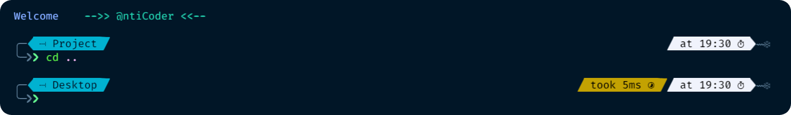

# Powershell Customization


### Steps : 
- Open Powershell ( Admin )<br>
&emsp; ``` Set-ExecutionPolicy RemoteSigned -Scope CurrentUser ```

- Install Font <br>
&emsp; ` Fira Code Retina.ttf `

- Copy <br>
&emsp; ` WindowsPowerShell Folder ` to  ` Documents `
